<div align="center">

# 🛰️ Cislunar Custody

### Custody Horizons for Ground-Based Angles-Only Tracking of Cislunar Periodic Orbits

*How long can an object near the Moon go unobserved before Earth's telescopes lose it for good?<br>
A computational study of NRHO, halo, Lyapunov and DRO orbits in the Earth–Moon three-body problem.*


**Bishwaswarup Nayak** · Indian Institute of Science, Bangalore · independent project

</div>

---

## The Result

**A cislunar object's custody is decided by how long it was tracked before the gap, not by the size of the search.**

Seen from Earth, cislunar targets sit only **4–14° from the Moon**. The Moon's glare and the
lunar phase therefore impose a monthly **8.5–15.7 day observation blackout** that no ground
network or bigger telescope can close. We define the **custody horizon** as the longest gap
after which the target is still inside the telescope search pattern with 99 % probability:

```math
T_c(N) = \max\left\{ \Delta t \;:\; \Pr\left[ \angle(\hat{\mathbf u}_{\mathrm{target}}, \hat{\mathbf c}) \le r_N \right] \ge 0.99 \right\},
\qquad r_N = \phi \sqrt{N/\pi}
```

Here the search pattern is $N$ fields of view of side $\phi = 1^\circ$. The post-fit
covariance $P_0$ at the gap start is the Cramér–Rao bound of the preceding tracking arc,
which the filters reach:

```math
\mathcal{I}(t_0) = \sum_k \Phi(t_k,t_0)^{\top} H_k^{\top} R^{-1} H_k \, \Phi(t_k,t_0),
\qquad
P_0 = \Phi \, \mathcal{I}^{-1} \, \Phi^{\top}
```

Propagating $P_0$ through gaps of 0.1–30 days (linear, unscented and Monte Carlo) gives:

| Orbit | Stability | $T_c$, 10 fields, after 1 / 3 / 7-day arcs | Blackouts survived (1 / 3 / 7-day arcs) |
| :-- | :--: | :--: | :--: |
| 9:2 NRHO (Gateway) | near-stable | **> 30 d** | 78 % / 100 % / 100 % |
| DRO (~70 000 km) | stable | **> 30 d** | 85 % / 100 % / 100 % |
| L1 halo ($A_z$ ≈ 30 000 km) | unstable | **11.0 / 13.2 / 16.5 d** | 89 % / 96 % / 100 % |
| L2 Lyapunov | unstable | **12.5 / 14.9 / 17.4 d** | 74 % / 97 % / 100 % |

The values are medians over arcs through the year (Tables 3 and 4 of the paper). Further findings:

- **The horizon is predictable without Monte Carlo.** The unscented transform of the post-fit
  covariance (13 sigma points) predicts $T_c$ with log-$R^2$ = 0.96 / 1.00 / 0.93 for 1 / 10 / 100
  fields. The orbit's finite-time Lyapunov exponent alone does **not** predict it (log-$R^2$ ≤ 0.04),
  because stretching only matters along the directions the post-fit covariance actually excites.
- **The operator's horizon equals the ideal one.** Centring the search on the UT prediction instead
  of the (unknowable) true mean gives the same $T_c$ (median ratio 1.00). Across 25 members of five
  orbit families, $T_c$ falls steadily with the stability index ν (Spearman ρ = −0.92 for ν > 10).
- **Linear prediction gives false custody.** After 14 days on the L1 halo, an EKF-style 99 %
  ellipse contains only **5.4 %** of the true probability (12.6 % in the ephemeris model), against
  **98 %** for the UT ellipse. The UT claims too long a horizon in only 2 of 254 arcs.
- **Watch the NRHO perilune.** The NRHO's sky-plane uncertainty swells at every perilune passage
  (every 6.56 d) and shrinks again, so a single-field search can lose the target there briefly.
- **Filter choice decides reacquisition.** After a 3.2-day gap on the L1 halo, the EKF ends consistent
  in 25 % of 100 runs, the UKF in 55 %, a particle filter in 91 % and a **Gaussian-mixture UKF in 99 %**.

All of this holds in a **JPL DE440 ephemeris model with solar radiation pressure**, where each
orbit is transitioned by multiple shooting (horizon ratio 0.93–1.01).

---

## Figures

<table>
<tr>
<td width="50%">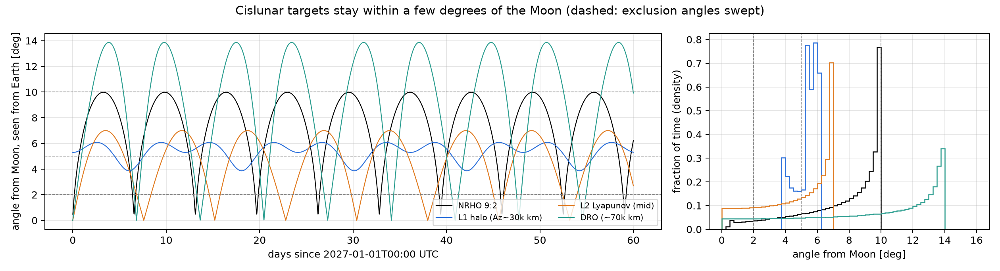<br><sub><b>Targets hug the Moon.</b> Angle from the Moon as seen from Earth; dashed lines are the exclusion angles.</sub></td>
<td width="50%">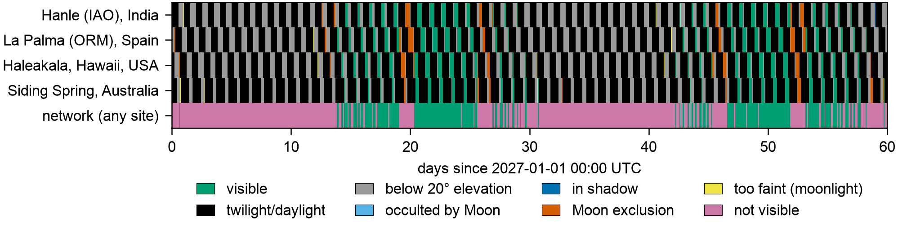<br><sub><b>The lunar-phase blackout.</b> First blocking constraint per site for the 9:2 NRHO over 60 days.</sub></td>
</tr>
<tr>
<td>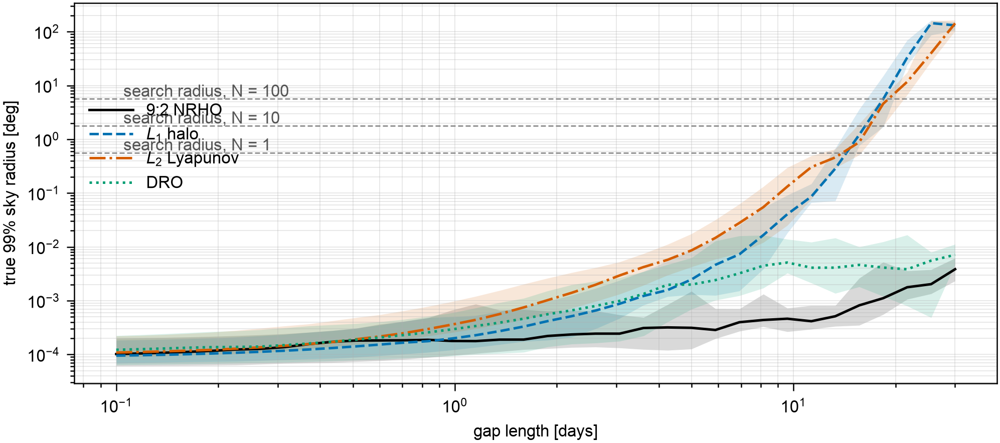<br><sub><b>Uncertainty growth.</b> True 99 % sky radius after 7-day arcs, against the search radii for 1, 10 and 100 fields.</sub></td>
<td>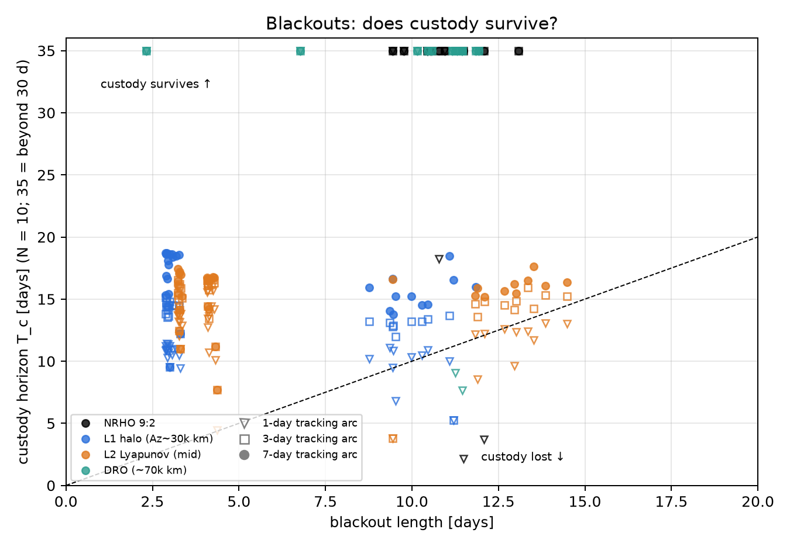<br><sub><b>Does custody survive?</b> Custody horizon against blackout length; points above the line survive.</sub></td>
</tr>
<tr>
<td>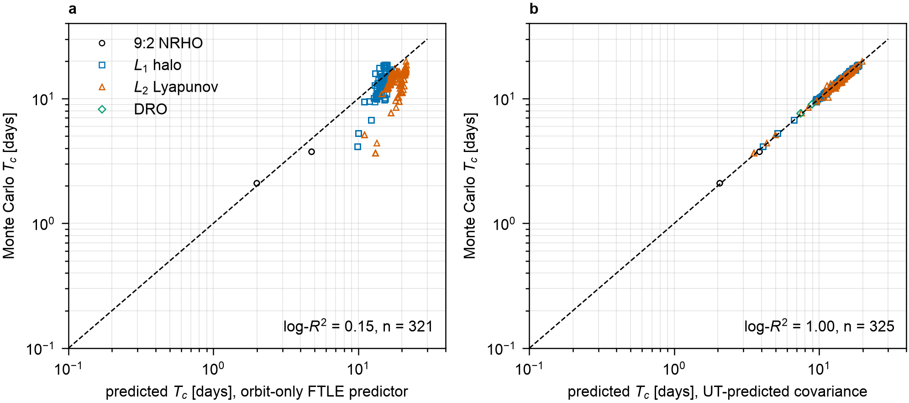<br><sub><b>Predicting T<sub>c</sub>.</b> Orbit-only FTLE (left) fails; UT-propagated covariance (right) matches Monte Carlo.</sub></td>
<td>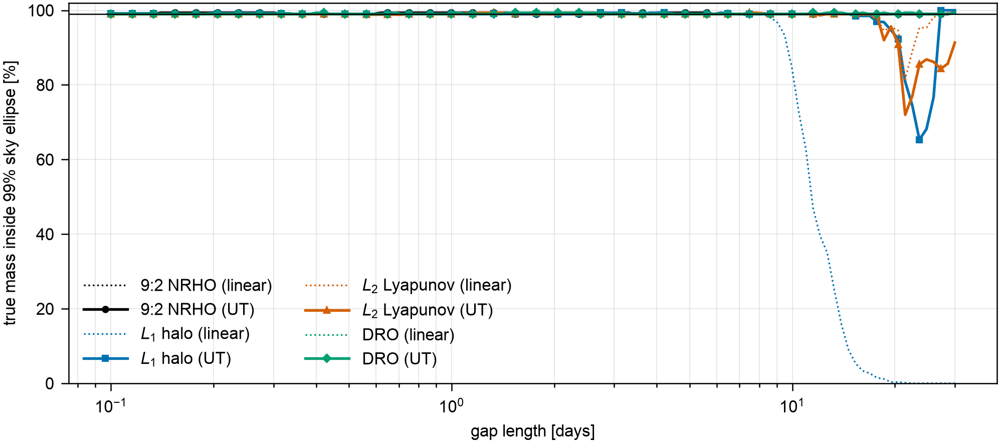<br><sub><b>False custody.</b> Probability mass inside linear (dotted) and UT (solid) 99 % ellipses.</sub></td>
</tr>
<tr>
<td>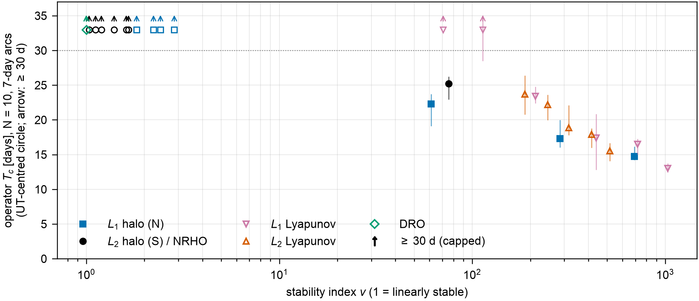<br><sub><b>Custody vs stability.</b> Operator horizon (UT-centred circle, 10 fields, 7-day arcs) across five families against stability index ν (paper Fig. 14).</sub></td>
<td>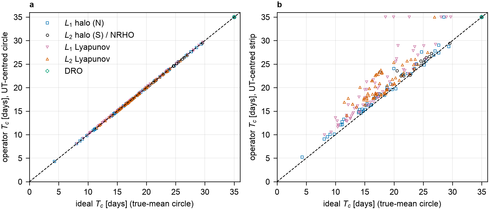<br><sub><b>Operator vs ideal.</b> Horizon with the search centred on the UT prediction (circle, strip) against the true-mean horizon.</sub></td>
</tr>
<tr>
<td>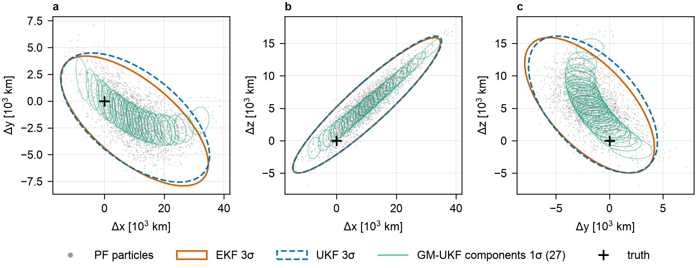<br><sub><b>After a 3.2-day gap.</b> Particles vs EKF/UKF ellipses vs GM-UKF components (L1 halo).</sub></td>
<td>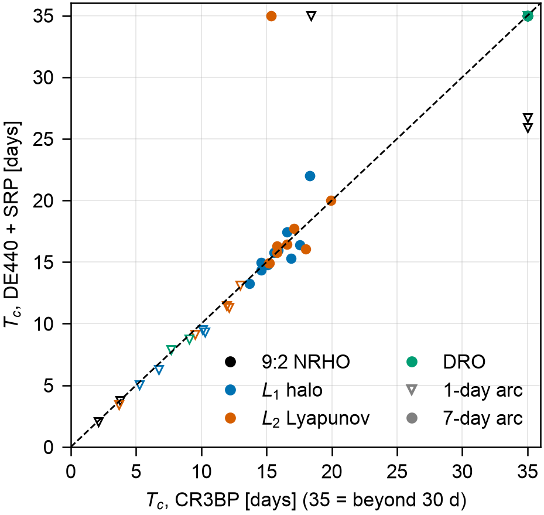<br><sub><b>Ephemeris check.</b> Custody horizon in the CR3BP vs DE440 + SRP.</sub></td>
</tr>
</table>

<p align="center"><br>
<sub>Earth–Moon CR3BP families: L1 halo, L2 halo → NRHO, L1/L2 Lyapunov and DRO; the 9:2 NRHO is in black.</sub></p>

---

## How it works

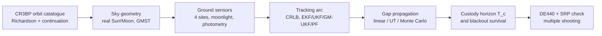

| Stage | What is done |
| :-- | :-- |
| **Dynamics** | Earth–Moon CR3BP ($\mu$ = 0.0121505842), STM verified to $3\times10^{-10}$. Families built from Richardson seeds by differential correction and pseudo-arclength continuation. 9:2 NRHO: $T$ = 6.5624 d, perilune 3249 km, apolune 71 222 km. |
| **Sensors** | Hanle · La Palma · Haleakala · Siding Spring. Twilight, 20° elevation, Moon exclusion and occultation, shadows, Lambertian photometry, Krisciunas–Schaefer moonlight. |
| **Estimation** | Fisher information from the real visible schedule. EKF, UKF, GM-UKF (entropy-triggered splits along the max-stretch direction), regularised PF with progressive correction and a UKF handover. |
| **Custody** | Post-fit covariance through 0.1–30 d gaps (121-point grid, converged to 0.15 d). Ideal, actual and claimed horizons; UT-centred circle and ellipse-aligned strip searches; Gaussian containment; FTLE vs UT predictors; 525 cases (394 distinct arcs). |
| **Ephemeris** | DE440 Sun and Moon + cannonball SRP, exact gravity-gradient STM, Levenberg–Marquardt + Newton multiple shooting. |

---

## Operational rules

> 1. **Shrink the Moon-exclusion angle before growing the aperture.** At 10° exclusion, L1/L2 targets are never visible; at 5°, 21–33 % of the year.
> 2. **Track at least 3 (preferably 7) days before every predicted blackout.** Extra sites do not remove it.
> 3. **Plan searches with unscented or Gaussian-mixture prediction.** On the L1 halo, linear prediction is safe only for gaps shorter than about 10 days.
> 4. **Reacquire with a Gaussian-mixture filter.** It costs about 2× a UKF and was the only filter to reacquire at least 99 % of runs.
> 5. **On the NRHO, time narrow searches away from perilune**, where the sky-plane uncertainty briefly swells.

---

## Quick start

```bash
git clone https://github.com/Bishwaswarup/cislunar-custody.git && cd cislunar-custody
python -m venv .venv && source .venv/bin/activate
pip install -e ".[dev,ephem]"
curl -o data/de440s.bsp https://naif.jpl.nasa.gov/pub/naif/generic_kernels/spk/planets/de440s.bsp
pytest                                    # 52 tests, ~15 s
```

<details>
<summary><b>Reproduce every result (click to expand)</b></summary>

| # | Command | Time | Produces |
| :-: | :-- | :-: | :-- |
| 1 | `python scripts/build_catalogue.py` then `python scripts/plot_catalogue.py` | ~20 s | orbit catalogue, fig01–02 |
| 2 | `python scripts/visibility_study.py` | ~10 s | one-year visibility, fig03–05 |
| 3 | `python scripts/observability_study.py` | ~10 s | CRLB of tracking arcs, fig06–07 |
| 4 | `python scripts/filter_study.py` | ~1 min | EKF/UKF Monte Carlo, fig08–09 |
| 5 | `python scripts/nonlinear_filter_study.py` | ~10 min | GM-UKF / PF reacquisition (100 runs), fig10–11 |
| 6 | `python scripts/custody_study.py` | ~12 min | custody horizons, fig12–15 |
| 7 | `python scripts/ephemeris_check.py` | ~6 min | DE440 + SRP cross-check, fig16–17 |
| 8 | `python scripts/sensitivity_check.py` | ~5 min | Monte Carlo sample-size check (300 vs 2000) and gap-grid check (37 vs 121 points vs uniform 0.02 d) |
| 9 | `python scripts/family_sweep.py` | ~25 min | operator horizons across whole families vs stability index, fig18–19 (paper Fig. 14–15) |
| 10 | `python scripts/verify_claims.py` | ~20 s | checks every number in `paper/main.tex` against `data/` (needs `family_sweep.csv`) |

Or run everything with `bash scripts/run_all.sh` (logs in `logs/`); `bash scripts/run_all.sh --check` only re-checks the paper.

Each script prints its summary tables. The steps depend on the earlier ones, so run them in order.
Figures are written twice: `figures/*.png` (previews) and `figures/jas/FigN` (PDF + 600 dpi TIFF,
84/174 mm wide, for the journal). `custody_study.py`, `ephemeris_check.py` and `nonlinear_filter_study.py`
accept `--plots-only` to redraw figures from saved data.

</details>

<details>
<summary><b>Repository layout</b></summary>

```
src/cislunar_custody/
├── dynamics/        CR3BP EOM + STM, periodic orbits, continuation, Richardson seeds
├── catalogue.py     orbit families (L1/L2 halo, NRHO, Lyapunov, DRO)
├── frames/          analytic Sun/Moon, GMST, sites, CR3BP → inertial
├── sensors/         telescopes, photometry, moonlight, visibility, RA/Dec
├── observability/   Fisher information and CRLB
├── filters/         EKF · UKF · GM-UKF · PF→UKF
├── scenario.py      measurement generation and a common filter runner
├── custody/         gap propagation and custody horizons
├── plotstyle.py     journal figure style (fonts, widths, FigN export)
└── ephem/           DE440, ephemeris + SRP dynamics, multiple shooting
scripts/             one script per milestone
tests/               52 pytest tests
.github/workflows/   CI: pytest on Python 3.10–3.14 with the DE440 kernel
paper/               LaTeX manuscript for JAS (Springer sn-jnl template: main.tex, references.bib)
```

</details>

<details>
<summary><b>Assumptions and limitations</b></summary>

- Truth and filters share the dynamics. The CR3BP study places orbits in the real Earth–Moon direction; the DE440 check confirms the results.
- Limiting magnitudes of 19.5 / 21.5 / 23.0 (0.36 / 1 / 2 m), extinction and dark-sky brightness are nominal; the first is anchored to LANL's 36 cm CAPSTONE detection.
- The post-fit covariance is the CRLB of the preceding arc. The filters reach it in tracking, but not always immediately after a gap.
- Targets are passive, non-manoeuvring 2 m spheres; data association is not modelled.
- The NRHO ephemeris counterpart keeps a 50–124 km continuity residual at perilune.
- $T_c$ is the *first* gap at which the 99 % radius exceeds the search radius. On the NRHO a brief perilune spike can end it, so the N = 1 NRHO horizon is sensitive to the Monte Carlo quantile (one arc moves from 5.3 to 17.6 d with 2000 samples).
- The strip search gains over the circle mainly where the cloud is sub-arcsecond thin across track, which relies on the idealised CRLB covariance (no biases, process noise or SRP uncertainty).

</details>

---

## Verification

Every number in the manuscript is re-computed from `data/` by `scripts/verify_claims.py`,
which reports each claim as PASS, FAIL (the paper is wrong), WEAK (right but statistically
thin: small n, wide confidence interval or a non-significant difference) or TEXT (the paper no
longer states it). Current report: `data/claims_report.txt`.

| Check | What it tests |
| :-- | :-- |
| Claim verifier | ~217 numbers in text and tables against the saved study outputs (0 FAIL, 6 WEAK) |
| Confidence intervals | 95 % Wilson intervals on filter success rates and blackout survival; Fisher exact tests between filters |
| Bootstrap | 95 % intervals on every log-R² of the custody-horizon predictors |
| Distinct arcs | pooled statistics count each tracking arc once (131 of the 525 cases repeat an arc) |
| Monte Carlo convergence | `sensitivity_check.py`: 300 vs 2000 samples change T_c by a median 0.09–0.14 d, at most 0.9 d for N = 10 and 100 |
| Grid convergence | 121-point gap grid vs a uniform 0.02-d grid: T_c changes by at most 0.15 d (N = 1, 10) and 0.6 d (N = 100) |
| Continuous integration | GitHub Actions runs the 52 tests on Python 3.10–3.14 on every push |
| Run count | reacquisition re-run with 100 Monte Carlo runs per filter (was 10) |
| Operator horizon | T_c with the search centred on the UT prediction (circle and ellipse-aligned strip), not on the true mean |
| Family sweep | T_c for members of all five families, with random orbital phase, against stability index |
| Reproducibility | every script re-runs deterministically from fixed seeds; `run_all.sh` regenerates everything |

---

## Roadmap

- [x] CR3BP catalogue · sensor model · observability · filters · custody horizons · ephemeris check
- [x] Manuscript in the Springer template, figures to JAS specifications (`paper/`, `figures/jas/`)
- [x] Claim verifier, sample-size check, confidence intervals
- [x] Operator horizon and family sweep: code, fig18–19, grid refinement (milestone 8)
- [ ] Operator horizon as the headline metric and family sweep in the paper
- [ ] Consider covariance (measurement bias, timing, SRP uncertainty) and filter-derived post-fit covariance
- [ ] Submission to *The Journal of the Astronautical Sciences*
- [ ] Real-data validation with Indian observatories (IIA Hanle, ARIES Devasthal, GROWTH-India)
- [ ] Custody-aware sensor tasking using the UT-predicted $T_c$

---

<div align="center">

**Bishwaswarup Nayak** · Department of Physics, Indian Institute of Science, Bangalore<br>
📧 bishwaswarup@iisc.ac.in · 🆔 [ORCID 0009-0001-9926-5329](https://orcid.org/0009-0001-9926-5329)

<sub>Manuscript prepared for <i>The Journal of the Astronautical Sciences</i>. To cite, use <b>Cite this repository</b> in the sidebar (from <code>CITATION.cff</code>). Code: MIT License.</sub>

</div>
