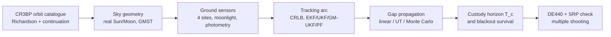

<div align="center">

# 🛰️ Cislunar Custody

### Custody Horizons for Ground-Based Angles-Only Tracking of Cislunar Periodic Orbits

*How long can an object near the Moon go unobserved before Earth's telescopes lose it for good?<br>
A computational study of NRHO, halo, Lyapunov and DRO orbits in the Earth–Moon three-body problem.*


**Bishwaswarup Nayak** · Indian Institute of Science, Bangalore · independent project

</div>

---

## The Result

**A cislunar object's custody is decided by how long it was tracked before the gap, not by the size of the search.**

Seen from Earth, cislunar targets sit only **4–14° from the Moon**. The Moon's glare and the
lunar phase therefore impose a monthly **8.5–16 day observation blackout** that no ground
network or bigger telescope can close. We define the **custody horizon** as the longest gap
after which the target is still inside the telescope search pattern with 99 % probability:

$$
T_c(N) \;=\; \max\Big\{\Delta t \;:\; \Pr\big[\angle(\hat{\mathbf u}_{\rm target},\hat{\mathbf c}) \le r_N\big] \ge 0.99\Big\},
\qquad r_N = \phi\sqrt{N/\pi}
$$

Here the search pattern is $N$ fields of view of side $\phi = 1^\circ$. The post-fit
covariance $P_0$ at the gap start is the Cramér–Rao bound of the preceding tracking arc,
which the filters reach:

$$
\mathcal I(t_0) = \sum_k \Phi(t_k,t_0)^{\top} H_k^{\top} R^{-1} H_k\, \Phi(t_k,t_0),
\qquad
P_0 = \Phi\,\mathcal I^{-1}\,\Phi^{\top}
$$

Propagating $P_0$ through gaps of 0.1–30 days (linear, unscented and Monte Carlo) gives:

| Orbit | Stability | $T_c$, 10 fields, after 1 / 3 / 7-day arcs | Blackouts survived (1 / 3 / 7-day arcs) |
| :-- | :--: | :--: | :--: |
| 9:2 NRHO (Gateway) | near-stable | **> 30 d** | 78 % / 100 % / 100 % |
| DRO (~70 000 km) | stable | **> 30 d** | 85 % / 100 % / 100 % |
| L1 halo ($A_z$ ≈ 30 000 km) | unstable | **11 / 13 / 17 d** | 89 % / 96 % / 100 % |
| L2 Lyapunov | unstable | **12 / 15 / 17 d** | 74 % / 97 % / 100 % |

Three further findings:

- **The horizon is predictable without Monte Carlo.** The unscented transform of the post-fit
  covariance (13 sigma points) predicts $T_c$ with log-$R^2 = 1.00$. The orbit's finite-time
  Lyapunov exponent alone does **not** predict it ($R^2 < 0.05$), because stretching only matters
  along the directions the post-fit covariance actually excites.
- **Linear prediction gives false custody.** After 14 days on the L1 halo, an EKF-style 99 %
  ellipse contains only **8–16 %** of the true probability, against **98 %** for the UT ellipse.
- **Filter choice decides reacquisition.** After a 3.2-day gap, the EKF ends consistent in 10 % of
  runs, the UKF in 70 % and a **Gaussian-mixture UKF in 100 %**.

All of this holds in a **JPL DE440 ephemeris model with solar radiation pressure**, where each
orbit is transitioned by multiple shooting (horizon ratio 0.93–1.01).

---

## Figures

<table>
<tr>
<td width="50%"><br><sub><b>Targets hug the Moon.</b> Angle from the Moon as seen from Earth; dashed lines are the exclusion angles.</sub></td>
<td width="50%"><br><sub><b>The lunar-phase blackout.</b> First blocking constraint per site for the 9:2 NRHO over 60 days.</sub></td>
</tr>
<tr>
<td><br><sub><b>Uncertainty growth.</b> True 99 % sky radius after 7-day arcs, against the search radii for 1, 10 and 100 fields.</sub></td>
<td><br><sub><b>Does custody survive?</b> Custody horizon against blackout length; points above the line survive.</sub></td>
</tr>
<tr>
<td><br><sub><b>Predicting T<sub>c</sub>.</b> Orbit-only FTLE (left) fails; UT-propagated covariance (right) matches Monte Carlo.</sub></td>
<td><br><sub><b>False custody.</b> Probability mass inside linear (dotted) and UT (solid) 99 % ellipses.</sub></td>
</tr>
<tr>
<td><br><sub><b>After a 3.2-day gap.</b> Particles vs EKF/UKF ellipses vs GM-UKF components (L1 halo).</sub></td>
<td><br><sub><b>Ephemeris check.</b> Custody horizon in the CR3BP vs DE440 + SRP.</sub></td>
</tr>
</table>

<p align="center"><br>
<sub>Earth–Moon CR3BP families: L1 halo, L2 halo → NRHO, L1/L2 Lyapunov and DRO; the 9:2 NRHO is in black.</sub></p>

---

## How it works



| Stage | What is done |
| :-- | :-- |
| **Dynamics** | Earth–Moon CR3BP ($\mu$ = 0.0121505842), STM verified to $3\times10^{-10}$. Families built from Richardson seeds by differential correction and pseudo-arclength continuation. 9:2 NRHO: $T$ = 6.5624 d, perilune 3249 km, apolune 71 222 km. |
| **Sensors** | Hanle · La Palma · Haleakala · Siding Spring. Twilight, 20° elevation, Moon exclusion and occultation, shadows, Lambertian photometry, Krisciunas–Schaefer moonlight. |
| **Estimation** | Fisher information from the real visible schedule. EKF, UKF, GM-UKF (entropy-triggered splits along the max-stretch direction), regularised PF with progressive correction and a UKF handover. |
| **Custody** | Post-fit covariance through 0.1–30 d gaps. Ideal, actual and claimed horizons; Gaussian containment; FTLE vs UT predictors; 525 cases. |
| **Ephemeris** | DE440 Sun and Moon + cannonball SRP, exact gravity-gradient STM, Levenberg–Marquardt + Newton multiple shooting. |

---

## Operational rules

> 1. **Shrink the Moon-exclusion angle before growing the aperture.** At 10° exclusion, L1/L2 targets are never visible; at 5°, 21–33 % of the year.
> 2. **Track at least 3 (preferably 7) days before every predicted blackout.** Extra sites do not remove it.
> 3. **Plan searches with unscented or Gaussian-mixture prediction.** Linear prediction is safe only for gaps shorter than about a week on unstable orbits.
> 4. **Reacquire with a Gaussian-mixture filter.** It costs about 2× a UKF and was the only filter to reacquire every run.

---

## Quick start

```bash
git clone https://github.com/Bishwaswarup/cislunar-custody.git && cd cislunar-custody
python -m venv .venv && source .venv/bin/activate
pip install -e ".[dev,ephem]"
curl -o data/de440s.bsp https://naif.jpl.nasa.gov/pub/naif/generic_kernels/spk/planets/de440s.bsp
pytest                                    # 47 tests, ~10 s
```

<details>
<summary><b>Reproduce every result (click to expand)</b></summary>

| # | Command | Time | Produces |
| :-: | :-- | :-: | :-- |
| 1 | `python scripts/build_catalogue.py` then `python scripts/plot_catalogue.py` | ~20 s | orbit catalogue, fig01–02 |
| 2 | `python scripts/visibility_study.py` | ~10 s | one-year visibility, fig03–05 |
| 3 | `python scripts/observability_study.py` | ~10 s | CRLB of tracking arcs, fig06–07 |
| 4 | `python scripts/filter_study.py` | ~1 min | EKF/UKF Monte Carlo, fig08–09 |
| 5 | `python scripts/nonlinear_filter_study.py` | ~1 min | GM-UKF / PF reacquisition, fig10–11 |
| 6 | `python scripts/custody_study.py` | ~12 min | custody horizons, fig12–15 |
| 7 | `python scripts/ephemeris_check.py` | ~6 min | DE440 + SRP cross-check, fig16–17 |

Each script prints its summary tables. The steps depend on the earlier ones, so run them in order.

</details>

<details>
<summary><b>Repository layout</b></summary>

```
src/cislunar_custody/
├── dynamics/        CR3BP EOM + STM, periodic orbits, continuation, Richardson seeds
├── catalogue.py     orbit families (L1/L2 halo, NRHO, Lyapunov, DRO)
├── frames/          analytic Sun/Moon, GMST, sites, CR3BP → inertial
├── sensors/         telescopes, photometry, moonlight, visibility, RA/Dec
├── observability/   Fisher information and CRLB
├── filters/         EKF · UKF · GM-UKF · PF→UKF
├── scenario.py      measurement generation and a common filter runner
├── custody/         gap propagation and custody horizons
└── ephem/           DE440, ephemeris + SRP dynamics, multiple shooting
scripts/             one script per milestone
tests/               47 pytest tests
paper/               LaTeX manuscript (main.tex, references.bib)
```

</details>

<details>
<summary><b>Assumptions and limitations</b></summary>

- Truth and filters share the dynamics. The CR3BP study places orbits in the real Earth–Moon direction; the DE440 check confirms the results.
- Limiting magnitudes of 19.5 / 21.5 / 23.0 (0.36 / 1 / 2 m), extinction and dark-sky brightness are nominal; the first is anchored to LANL's 36 cm CAPSTONE detection.
- The post-fit covariance is the CRLB of the preceding arc. The filters reach it in tracking, but not always immediately after a gap.
- Targets are passive, non-manoeuvring 2 m spheres; data association is not modelled.
- The NRHO ephemeris counterpart keeps a 50–124 km continuity residual at perilune.

</details>

---

## Roadmap

- [x] CR3BP catalogue · sensor model · observability · filters · custody horizons · ephemeris check
- [x] Manuscript draft (`paper/`)
- [ ] Submission (*The Journal of the Astronautical Sciences*) and arXiv preprint
- [ ] Real-data validation with Indian observatories (IIA Hanle, ARIES Devasthal, GROWTH-India)
- [ ] Custody-aware sensor tasking using the UT-predicted $T_c$

---

<div align="center">

**Bishwaswarup Nayak** · Department of Physics, Indian Institute of Science, Bangalore<br>
📧 bishwaswarup@iisc.ac.in · 🆔 [ORCID 0009-0001-9926-5329](https://orcid.org/0009-0001-9926-5329)

<sub>Manuscript in preparation. Please contact the author before reusing the results. Code: MIT License.</sub>

</div>
