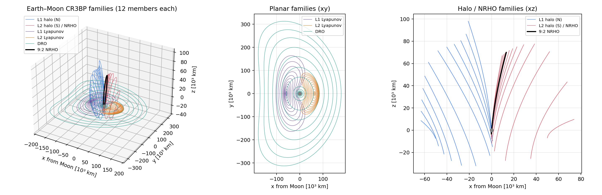
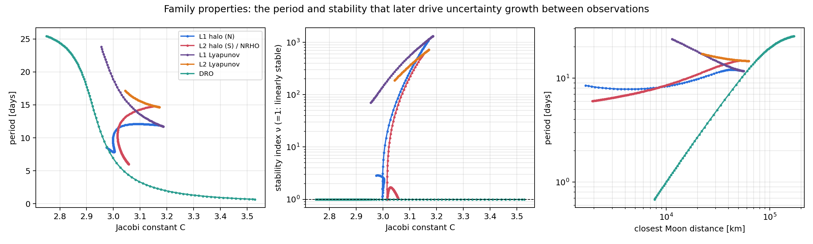

# cislunar-custody

**Custody horizons for ground-based angles-only tracking of cislunar periodic orbits.**

How long can an Earth-based optical network lose sight of an object on a halo, NRHO,
DRO or Lyapunov orbit before it can no longer be reacquired, and can that *custody
horizon* be predicted from the orbit's local dynamics (FTLE / STM stretching) instead
of Monte Carlo filter runs?

Research plan: see the Cislunar Angles-Only Tracking research plan doc.

## Status

| Milestone | Status |
| --- | --- |
| 1. Dynamics + orbit catalogue (CR3BP, STM, families) | ✅ done |
| 2. Sensor model (visibility, Moon exclusion, photometry) | next |
| 3. Observability (Fisher information maps) | – |
| 4. EKF / SR-UKF | – |
| 5. GM-UKF / particle filter | – |
| 6. Monte Carlo custody sweep | – |
| 7. FTLE predictor | – |
| 8. Ephemeris (DE440) cross-check | – |

## Milestone 1 results (Earth–Moon CR3BP, μ = 0.0121505842)

| Orbit / family | Members | Check |
| --- | --- | --- |
| L1 halo (northern), to L1 NRHOs | 88 | Richardson 3rd-order seed → corrected in 4 iterations |
| L2 halo (southern), to L2 NRHOs | 140 | continued until perilune < 1,900 km |
| L1 / L2 Lyapunov | 60 / 60 | stability index 70 to 1,300 (strongly unstable) |
| DRO | 94 | ν = 1 across the family (linearly stable) |
| **9:2 NRHO** | – | T = 6.5624 d, perilune 3,249 km, apolune 71,222 km, ν = 1.32 |
| 4:1 NRHO | – | T = 7.3826 d, perilune 5,750 km, apolune 75,519 km |

Verification: the STM agrees with Richardson-extrapolated finite differences to
3×10⁻¹⁰ (relative), det Φ = 1, the Jacobi constant is conserved to 10⁻¹⁰ over 10 TU, and
orbits close to within 10⁻⁸ LU.




## Layout

```
src/cislunar_custody/
  constants.py          GM values (DE440), LU/TU, radii
  dynamics/cr3bp.py     EOM, Jacobian, STM, Jacobi constant, Lagrange points
  dynamics/periodic.py  PeriodicOrbit, differential correction, pseudo-arclength continuation
  dynamics/seeds.py     Richardson halo, linear Lyapunov, DRO initial guesses
  catalogue.py          build / save / load the family catalogue
scripts/build_catalogue.py   -> data/catalogue.npz, data/named_orbits.json (~30 s)
scripts/plot_catalogue.py    -> figures/fig01_families.png, fig02_family_properties.png
tests/                       pytest suite
```

## Quick start

```bash
python -m venv .venv && source .venv/bin/activate
pip install -e ".[dev]"
pytest                        # 13 tests, ~12 s
python scripts/build_catalogue.py
python scripts/plot_catalogue.py
```

```python
from cislunar_custody.catalogue import load_named
nrho = load_named("data/catalogue.npz", "NRHO_9:2")
t, states = nrho.trajectory(2000)
M = nrho.monodromy()
```

## References

- Richardson, D. L. (1980). Analytic construction of periodic orbits about the collinear points. *Celestial Mechanics* 22.
- Koon, Lo, Marsden & Ross (2011). *Dynamical Systems, the Three-Body Problem and Space Mission Design.*
- Chow et al. (2021), AMOS; Frueh et al. (2021), AAS 21-290; Iannamorelli & LeGrand (2023), AMOS: see the research plan for the full review.

Author: Bishwaswarup Nayak (IISc). MIT License.
